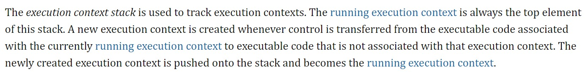
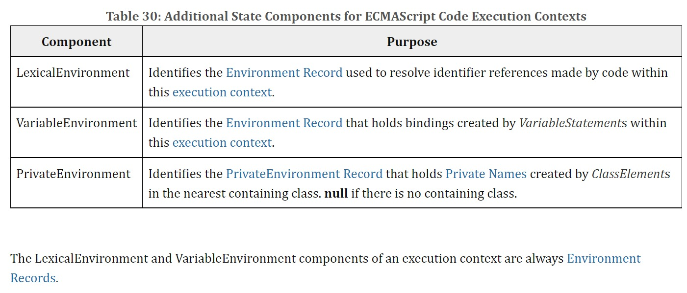
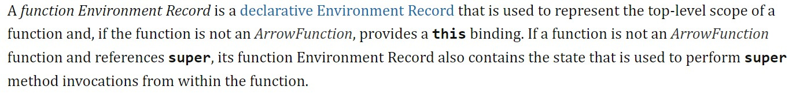
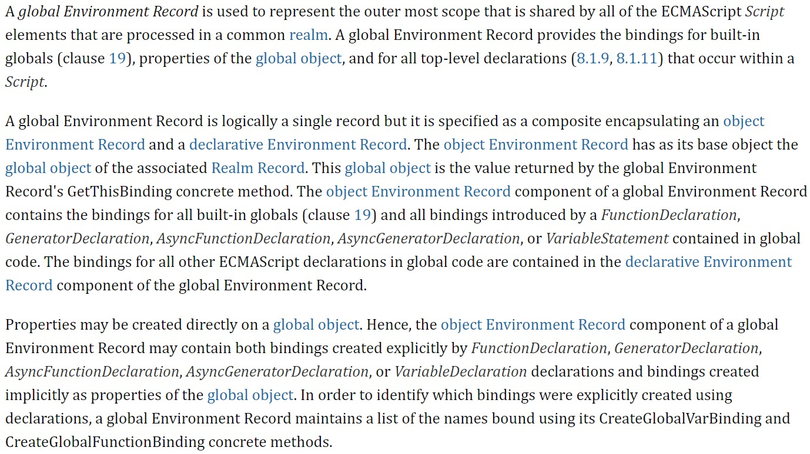

<!--
 * @Descripttion: 
 * @version: 
 * @Author: 鹿角兔子
 * @Date: 2021-09-14 18:42:07
 * @LastEditors: 鹿角兔子
 * @LastEditTime: 2022-01-25 02:21:40
-->
- [x] call、bind、apply手写
- [x] 手写节流、防抖
- [ ] 观察者、订阅/发布模式
- [x] 匿名函数
- [ ] 阶乘
- [x] 原型
- [x] 箭头函数
- [x] 作用域链
- [x] 柯里化
- [x] 执行上下文
- [x] class
- [x] this
- [ ] 垃圾回收机制 
- [ ] webCompoments
- [ ] react
- [x] 深拷贝
- [x] 左右布局
- [x] promise
- [ ] http2
- [x] 检查页面性能方案
- [ ] 强缓存更新资源
- [ ] parcel名字hash

1. ## [call、apply](./call-bind-apply/index.js)、[bind](./call-bind-apply/bind.js)
2. ## 节流 throttle、防抖 debounce
     - > [节流](./throttle-debounce/throttle.js): 设定 X 秒执行事件，等待期间无法重复触发
     - > [防抖](./throttle-debounce/debounce.js): 设定 X 秒执行事件，若事件被提前触发，则刷新等待时间
3. ## [匿名函数](./nameLessFn/index.js)
   > this一般取window，可以被call、bind、apply改变this
4. ## [箭头函数](./arrowFn/index.js)
   1. 箭头函数不会创建自己的 this，只会从自己的作用域链的上一层继承 this ；与闭包类似，箭头函数的 this 决定于函数定义的作用域
   2. 箭头函数没有自己arguments，但是可以用...args来代替参数列表
5. ## [柯里化](./createCurry/index.js)
   > createCurry，接受一个函数A作为参数，并对A进行包装后返回一个函数B，并且函数B能够处理A函数的剩余参数  
   > 优点：  
   > 1. 收集参数，延时处理

6. ## ~~[作用域链](./scopeChain/index.js)~~
  - > ~~ES6前只有 全局作用域 和 函数作用域，ES6新增 let 、const 增加了块级作用域；全局 > 函数 > 块级~~
  - > ~~函数内通过 var 定义的变量可在全函数内访问，let/const 定义的变量只有在其定义块级以及子块级可被访问~~
  - > ~~函数Fn中变量X的取值要到 **创建函数Fn的那个域中寻找，若没有则往上层作用域寻找，这里强调的是“创建”，而不是“调用”**~~
7. ## [执行上下文]()
   - > An execution context is a specification device that is used to track the runtime evaluation of code by an ECMAScript implementation.
      > >  执行上下文是一种跟踪ECMAScript代码执行的规范机制
   - > 
      > > 执行上下文栈(下文称 **ex-stack**)用于存放多个执行上下文(下文称 **ex**)。当前执行上下文(下文称 **running-ex**)总是在 **ex-stack** 的最上层。当前运行代码从与 **running-ex** 相关连的代码转移到无关代码时，就会生成一个新的 **ex** ，而新生成的 **ex** 就会被放入到 **ex-stack** 中，并成为 **running-ex**。
   - > 
      > > **ex** 有如上所示三种 environment 组件用于保存状态，LexicalEnvironment 和 VariableEnvironment 都属于 [Environment Records](#8)
8. ## [环境记录]()
   - > Environment Record is a specification type used to define the association of Identifiers to specific variables and functions, based upon the lexical nesting structure of ECMAScript code.
      > > 环境记录是一种用于定义 标识符 与 变量和函数 之间 基于词法嵌套结构( **lexical nesting structure** ) 的联系的规范。
   - > Usually an Environment Record is associated with some specific syntactic structure of ECMAScript code such as a **FunctionDeclaration**, a **BlockStatement**, or a **Catch clause of a TryStatement**. 
      > > 环境记录与某些特定语法结构相关联，例如 函数表达式 、 块级代码 和 Catch代码块
      > > >  Each time such code is evaluated, a new Environment Record is created to record the identifier bindings that are created by that code.
      > > > 每当像这样的代码被执行时，一个新的环境记录就会被创建用于保存由这段代码生成的 标识符绑定( identifier bindings )
   - > Every Environment Record has an [[OuterEnv]] field, which is either null or a reference to an outer Environment Record.
      > > 每一个环境记录都有一个 [[OuterEnv]]，他的值要不是 null 要不 指向外部环境记录
      > > > An Environment Record may serve as the outer environment for multiple inner Environment Records. For example, if a FunctionDeclaration contains two nested FunctionDeclarations then the Environment Records of each of the nested functions will have as their outer Environment Record the Environment Record of the current evaluation of the surrounding function.  
      > > > 一个环境记录可能作为一个 [[OuterEnv]] 为多个内部环境记录服务。[例子](./environment-records/index.js)
   - ### 环境记录分类
      >>> 1. ## Declarative Environment Record 
      >>>      1. ### Function Environment Record
      >>>      2. ### Module Environment Record 
      >>> 2. ## Object Environment Record 
      >>> 3. ## Global Environment Record

      1. ## Declarative Environment Record 
         > 
         > 每一个 declarative Environment Record 和代码中的某段 scope 紧密相关，这段 scope 中包含各种定义的变量、常量或者函数的语法：variable、constant、let、class、module、import、functions。

         1. ### Function Environment Record
            > 
            > Function Environment Record 代表是一个函数的顶层作用域
               > > - 如果函数不是 箭头函数，那么 env 就会提供 this 绑定  
               > > - 如果函数不是 箭头函数，并且内部引用了 super 调用父类，那么 env 还会包含 super 所需要的父类状态
         2. ### Module Environment Record 
            > 
            > Module Environment Record 代表的是外层模块作用域，除了普通的可变和不可变绑定外，Module Environment Record 还提供一种不可变绑定可以间接访问其他 Moudle
      2. ## Object Environment Record 
         > 
         > 每一个 Object Environment Record 都有一个自己的 绑定对象(binding object)，一个 Object env 上绑定了该对象上的所有 字符串属性 的标识符，而不是 字符串属性 的标识符则不会被绑定，
            >> - 绑定对象本身和继承的属性都会被 Object env 绑定为标识符  
            >> - 绑定对象的属性增减也会导致 Object env 的标识符绑定发生变化，通过这种新增对象属性所导致的绑定都是可变绑定(即使该属性不可写)
      3. ## Global Environment Record
            
          - Global Environment Record 代表是最外层的作用域，它提供几种绑定: 内置的全局对象，全局对象的属性和script元素内的所有顶层声明  
          - Global Environment Record在逻辑上是一个单独的env，但是在标准定义中，它其实是一个 object Environment Record和 declarative Environment Record的组合体。  
            - object Environment Record包含了全部的内置全局变量，我们代码中经常会出现的NaN，undefined，Infinity，还有parseInt, parseFloat方法，等等，这些都是包含在这个Environment Record的绑定之中的。结合with语句的使用（with语句所创建的就是一个object env），我们就可以明白在代码中为什么可以直接写NaN，而不需要写global.NaN。
            - 除了这些内置的全局变量之外，object Environment Record中还包括以下这些语法所声明的绑定：函数声明、generator函数声明、异步函数声明（async）、异步generator函数声明和var声明。
            - 除了上述的情况之外，其他在全局环境中的声明都包含在了declarative Environment Record中，例如全局环境下的let, const，class语句。

9. ## [原型]()
   > ### Each **constructor** is a function that has a property named "prototype" that is used to implement *prototype-based inheritance* and *shared properties*.  

   每一个[构造函数](#constructor)都有一个叫 **prototyoe** 的属性用于基于原型的继承和共享属性。 

    

   > ### Every object created by a constructor has an implicit reference (called the object's prototype) to the value of its constructor's "**prototype**" property. Furthermore, a prototype may have a non-null implicit reference to its prototype, and so on; this is called the prototype chain.  
   
   所有由构造函数创造的对象都有一个隐式引用(\_\_proto__)指向构造函数的 **prototype** 属性。并且，一个 **prototype** 也拥有一个非空的隐式引用(\_\_proto__)指向构建该**prototype**对象的构造函数的**prototype**，这就是原型链
   
10. ## [构造函数]()
   > ### A function object is an object that supports the [[Call]] internal method. A constructor is an object that supports the [[Construct]] internal method. Every object that supports [[Construct]] must support [[Call]]; that is, every constructor must be a function object. Therefore, a constructor may also be referred to as a *constructor function* or *constructor function object*.   

   一个函数对象是支持内部[[Call]]方法的对象。**constructor** 是一个支持内部[[Construct]]方法的对象。每一个支持[[Construct]]的对象都必定支持[[Call]]，也就是说每一个 **constructor** 都是一个函数对象。因此一个 **constructor** 可以称作 *constructor function* 或者 *constructor function object*
   
11. ## 古典继承
    1.  [盗用构造函数继承](./classical-extend/constructor-stealing.js)
    2.  [原型继承](./classical-extend/prototype-extend.js)
    3.  [组合继承](./classical-extend/combination-extend.js)
    4.  [寄生式继承](./classical-extend/parasitic-inheritance.js)
    5.  [寄生组合继承](./classical-extend/parasitic-combination.js)
12. ## [深拷贝](./deepClone/index.js)
13. ## [Promise](https://developer.mozilla.org/zh-CN/docs/Web/JavaScript/Reference/Global_Objects/Promise)
    1.  一个 **Promise** 必然处于以下几种状态之一:
        1.  待定 *(pending)*：初始状态，既没有兑现，也没有拒绝
        2.  已兑现 *(fulfilled)*：意味着操作成功完成
        3.  已拒绝 *(rejected)*：意味着操作失败
    2. **Promise.*resolve***，接受一个参数 **thenable** 若参数非空则返回的 **Promise** 对象则会跟随这个 **thenable** 的对象并采用它的最终状态；将 **Promise** 对象状态改变为 *(fulfilled)*，同时在 **Promise.*then*** 中：
       1. **return**， **return Promise.*resolve***
       2. 无 **return**
       3. 都会改变状态为 *(fulfilled)*, [例子](./Promise/resolve.js)
    3.  **Promise.*reject***，将 **Promise** 对象状态改变为 *(rejected)*，同时在 **Promise.*then*** 中：
        1.  **thorw**
        2.  **return Promise.*reject***
        3.  都会改变状态为 *(rejected)*, [例子](./Promise/reject.js)
    4. 拓展题: [并行限制Promise](./Promise/parallelPromise.js)
    5. 拓展题: [并行限制Promise/字节版](./Promise/parallelPromise.js)