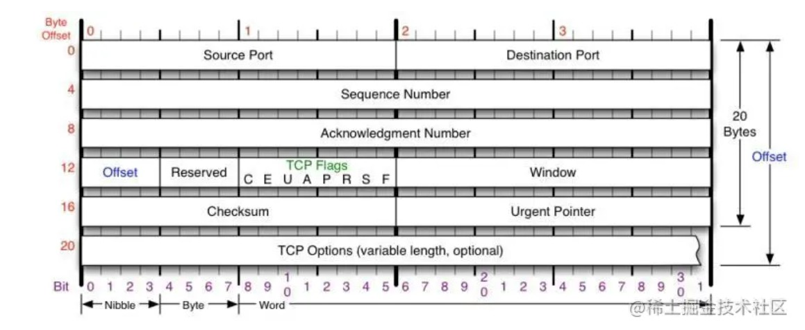
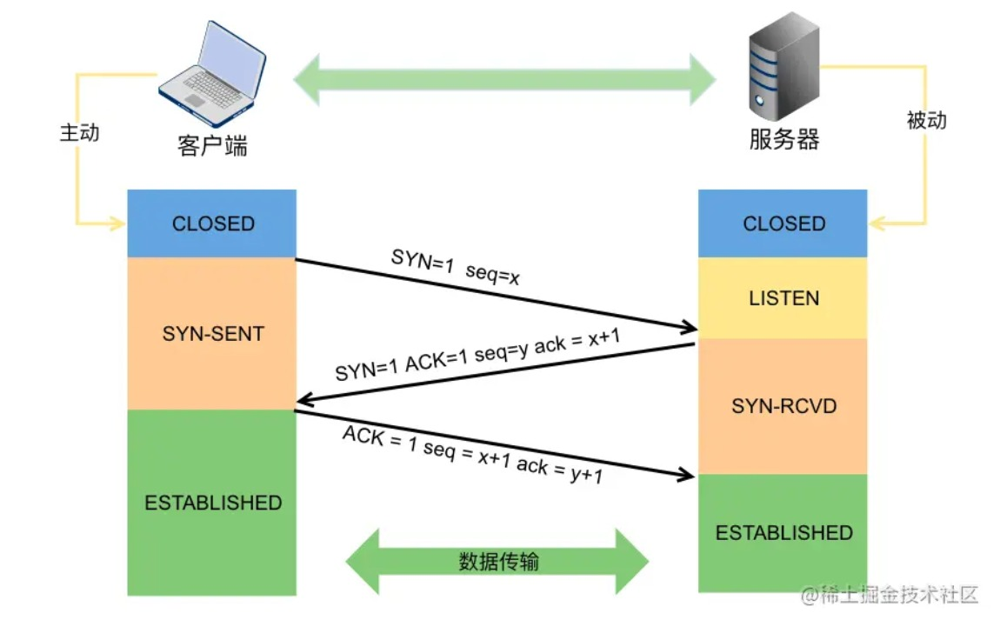
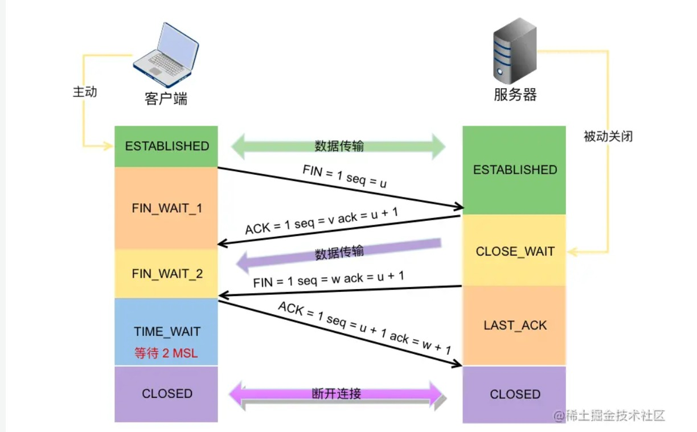

<!--
 * @Descripttion: 
 * @version: 
 * @Author: 鹿角兔子
 * @Date: 2021-10-29 18:36:12
 * @LastEditors: 鹿角兔子
 * @LastEditTime: 2022-01-03 01:02:18
-->
1. ## 在浏览器中用什么办法进行跳转，无法使用后退返回上一页
   1. location.replace() 会直接将 History 中的当前页面替换成目标页面
   2. location.assign() 则会把目标页面推入 History中
   
2. ## 浏览器缓存。如何配置缓存。对不同类型的文件 (如 js html)文件的缓存配置是否一致
   1. 强缓存
      1. http/1.0 中使用 Expires 来决定过期日期，值为一个绝对时间
      2. http/1.1 中使用 max-age 来决定相对过期时间，值为一个相对时间，单位为秒，也就是 **获取缓存的时间 + max-age = 过期时间**
      3. 实际上 Expires 和 max-age 都可以通过修改客户端本地时间来让其失效，因为浏览器通过 [**now - response_time > max-age || (Expires - Date)**](https://www.w3.org/Protocols/rfc2616/rfc2616-sec13.html)
      4. Cache-Control 还提供多个指令，例如：
         1. **public** 表明对象可以被任何对象（客户端、代理服务器等）缓存
         2. **private** 表明对象只能被客户端缓存
         3. **no-cache** 则跳过强缓存检验阶段，直接到服务器上进行协商缓存验证
         4. **no-store** 则表示不会使用任何缓存
      5. 如果响应头中既没有 Expires 也没有 Cache-Control，浏览器也会进行强缓存，缓存的时间为 **(Date - last-modified) * 0.1**，称之为启发式缓存
   2. 协商缓存
      1. 服务器会在浏览器的第一次请求的响应头上加上 Last-Modified 这个字段，之后浏览器发送请求时都会带上 If-Modified-Since 值为 Last-Modified，服务器会对比 If-Modified-Since 和对应资源的的最后修改时间，若是不一样则返回新的资源，若果一样则返回 304 让浏览器使用缓存
      2. 服务器会对各个文件生成一个唯一标志 ETag，一旦文件发生变化 ETag 也会发生变化，在这基础上：浏览器每一次新的请求都会带上 If-None_match 值为上一次从服务器收到的 ETag，服务器会对比 If-None-match 指向的文件的Etag，不一样则返回新的资源
      3. ETag 优先度比 last-modified 更高
   3. 在nginx中对目标使用 add_header 语句添加表头，根据需求使用缓存，如果是类似css、图片等不常更改的文件则使用强缓存，但如果是频繁变动的资源像HTML则使用协商缓存
   
3. ## 新开一个 tab 会开一个线程还是进程
   1. 每一个页面都是进程，并且分为浏览器进程、GPU进程、网络进程、渲染进程
      1. 浏览器进程：负责浏览器的UI功能并且提供缓存功能
      2. GPU进程：负责页面的渲染，特别是CSS3渲染
      3. 网络进程：负责发起和接受网络请求
      4. 渲染进程：将HTML、CSS、JS转化为可用页面
   
4. ## CDN 
   1. 通过布置多个 **节点服务器** 构成一个服务器网络，当有用户访问数据时，CDN会根据用户的 **IP地址** 导向最近的服务器获取数据
   
5. ## 回源
   1. CDN 的节点服务器不仅在广度上布置多个服务器，在深度上也有父子服务器的继承关系，当用户访问CDN边缘服务器上某个缺失或者过期的数据时，CDN边缘服务器便会向父服务器请求，若父服务器也没有该数据则继续向中心层访问
   
6. ## 一个页面同时发起100个http请求，需要建立几次连接？
   1. http/1.1 并行多个请求需要建立多个tcp，需要建立100次
   
7. ## http2 优化
   1. 二进制分帧
      1. http/2 中所有信息都会被分割成更小的消息和帧，http/2 中可承载多个数据流，每个数据流上包含多个消息，而消息又由多个帧组成，这些帧可以乱序发送，然后通过header上的流标识符重新组装
   2. 首部压缩
      1. http/2 对响应表头数据进行压缩，不仅减少了大小，同时还会让客户端和服务器同时维护一个header表，这个表会储存过去传输的表头数据，客户端和服务器不需要发送已经储存的表头字段，只需要发送有差异的表头字段
   3. 多路复用
      1. http/1.1 中多个并行的请求只能通过建立多个 tcp 连接解决，而在 http/2 中则可以在一个 tcp 连接中建立多个并行的数据流，然后在数据流中发送多个乱序帧，最后按照各个帧表头的序号组装。
   4. 服务器推送
      1. 服务器可以主动向客户端发送客户端未请求的资源，例如客户端请求了某个html后，服务器就向客户端发送配套的css和js
   
8. ## http 报文信息
   1. 请求报文
      1. 请求行：请求方法 + 请求URL + HTTP版本
      2. 请求头
      3. 空行：告知服务器请求头结束
      4. 请求体
   2. 响应报文
      1. 状态行：HTTP版本 + 状态码 + 状态描述符
      2. 响应头：字段名 + 对应的值
      3. 空行
      4. 响应体
   
9.  ## HTTP常见状态码
    1.  2xx：请求成功并处理成功
    2.  3xx： 资源重定向
        1.  301：永久重定向
        2.  302：临时重定向
        3.  304：命中协商缓存
    3. 4xx：请求错误无法处理
       1. 401：缺少身份权限，需要进行验证
       2. 403：禁止访问
       3. 404
    4. 5xx：服务器错误
       1. 502：服务器作为网关或代理出错，服务器本身正常，但是访问后端服务器错误
       2. 503：服务器繁忙
       3. 504：网关超时
    
10. ## 长轮询短轮询
    1.  短轮询：客户端每隔一段时间进行请求，服务器无论请求数据是否有更新都返回响应
        1.  若在短时间内不断的进行请求会严重浪费服务器和客户端资源
    2.  长轮询：客户端发起请求，服务器收到后不会立即响应，而是等到请求数据有更新或者到达一定时间限制才响应
        1.  若轮询周期过长同样也会浪费服务器资源
    
11. ## https通信
    1.  [彻底搞懂HTTPS的加密原理](https://zhuanlan.zhihu.com/p/43789231)
    
12. ## 优化首页加载速度
    1.  在网络传输上可以使用gzip对文件进行压缩，另外对css、js、图片等不常改动的静态文件设置强缓存加快第二次访问的加载速度，对于某些的业务请求可以缓存在nginx服务器上减少 客户端-nginx-后端 的通信时间
    2.  项目方面 parcel 可以通过 import() 动态引入依赖，或者直接使用CDN服务从服务商那请求常见的依赖包
    3.  具体的页面，例如多表格图片的长页面，需要注意尽可能对包裹表格图片的卡片元素设置定高减少重排，另外也要避免CSS大量使用@import导入，因为如果@import嵌套了多个文件，浏览器就会串行请求文件
    
13. ## 事件冒泡和事件捕获
    1.  事件传递路径从 ***window*** 开始在 ***eventTarget*** 结束，
    2.  事件捕获阶段从 ***window*** 开始经过每一个包裹 ***eventTarget*** 的祖先元素
    3.  结束事件捕获和 ***eventTarget*** 本身事件后开始事件冒泡，该阶段从 ***eventTarget*** 开始并在 ***window*** 结束
    4.  事件流中只要有一个阶段执行 ***stopPropagation*** 行为阻止事件传递，事件流就会停止
    5.  并且事件传播路径经过的每一个元素只要有和当前触发事件类型一致的事件都会在对应阶段被执行
14. ## cookie
    1.  cookie 是服务器发送给浏览器并保存在本地的一小块数据，主要用于管理客户端数据
    2.  常见的属性
        1.  httponly: 禁止浏览器读取 cookie，防止 xss 攻击
        2.  Secure: 只允许在 https 中传输 cookie
        3.  samesite: 要求 cookie 只能在相同域名中被传输
            1.  strict：浏览器将只在访问相同站点(URL一致)时发送 cookie
            2.  lax：从外部网站通过链接点击访问到时会发送 cookie，主要用于跳转不同服务
            3.  none：可跨域传输 cookie
15. ## 第三方cookie的数据跟踪
    1.  **Facebook Pixel** 
        1.  用户在访问设置有 **Facebook Pixel** 的网站时，每当在该网站做一个敏感的操作就会向Facebook的系统发送请求记录这些操作，同时还会在设置域指向Facebook的cookie，当用户访问登录Facebook本站时，Facebook就会把这些 **cookie** 和用户ID关联起来
    2. 阿里妈妈、tanx
16. ## CSRF攻击
    1. 利用 **cookie** 满足条件(sercue、domain、path、samesite)即可跨域携带的特性，第三方网站通过各种方法诱导受害者访问他们的网站，受害者访问第三方网站同时携带受害者的 **cookie** 访问第一方网站，因为 **cookie** 存放了用于认证受害者身份的 **token**，所以服务器无法分辨是受害者还是第三方网站发送的请求而执行。
    2. 第三方网站一般会在自己的网站中埋下受害者无法轻易发现的请求，例如
      ```javascript
         // Get请求
           
      ```
      ```javascript
         // POST 请求
          <form action="http://bank.example/withdraw" method=POST>
            <input type="hidden" name="account" value="xiaoming" />
            <input type="hidden" name="amount" value="10000" />
            <input type="hidden" name="for" value="hacker" />
         </form>
         <script> document.forms[0].submit(); </script> 
      ```
    3. 防范方法：
       1. 服务器黑白名单
          1. 服务器检查请求 **Origin Header** 和 **Referer Header** 来判断请求来源是否可信
       2. CSRF Token
          1. 服务器向客户端返回一个加密后的 token (不能通过 **cookie** 传输)，客户端每一次请求都带上这一个 **token**，服务器以此区分客户端的请求和第三方网站的请求
       3. samesite
17. ## XSS攻击
    1. 利用代码设计的漏洞，将恶意代码混入到正常的代码中，浏览器无法识别正常代码和恶意代码而错误执行
    2. 注入类型：
       1. 存储型
          1. 将恶意代码存储到数据库中，用户打开网站时从数据库读取到恶意代码，恶意代码被拼接成 HTML，又或者被当成函数参数执行
       2. 反射型
          1. 前端代码存在漏洞，将url的参数作为函数参数执行，攻击者在url参数中埋入了恶意代码
    3. 防范方法：
       1. 前端渲染框架：
          1. 通过使用Vue等前端渲染框架，浏览器先渲染HTMl部分，再执行javaScript请求业务数据展示在页面上，避免后端渲染过程拼接HTML过程中将恶意代码混入HTML
       2. 转义库：
          1. 通过一些转义库，在存入数据库前或者插入到HTML模板前调用转义库将 **< > / &** 等特殊字符转义
       3. 反射型防范：
          1. 没有具体的方案，只能在使用URL参数时对参数进行敏感字符检测或者进行转义
18. ## [从输入地址到出现完整页面](https://juejin.cn/post/6844904155077672968#heading-14)
    1.  读取解析URL
        1. 浏览器检测URL是否符合URL规则
            > scheme:[//authority]path[?query][#fragment]  
         对符合URL的输入进行URL请求，否则使用浏览器默认搜索引擎搜索输入文本
        2. 接着进行DNS解析
           1. 浏览器会先在 **本地hosts文件** 、 **本地DNS服务器** 、 **浏览器缓存** 查找是否有对应域名
           2. 如果本地中找不到，那么 **本地DNS服务器** 就会向 **根DNS服务器**请求
                 1. **根域名服务器** 会根据域名查询其对应的 **顶级域名服务器**，并返回 **顶级域名服务器** 的IP给 **本地DNS服务器**，**本地DNS服务器** 会向 **顶级域名服务器** 请求对应域名IP，若 **顶级域名服务器** 没有则会返回 **顶级域名服务器** 的下一级服务器IP，直到找到域名。
        3. TCP链接
        4. 网页下载完后，浏览器调用 **GUI渲染线程** 开始解析HTML构建 **DOM树** ，在构建过程中如果遇到 **\<script>** 标签，则会挂起 **GUI渲染线程** 调用 **JS线程** 去执行JS文件。
           1. **GUI渲染线程** 和 **JS线程** 互斥是防止JS对DOM的修改操作改变了DOM树，使DOM树需要重新构建  
           2. 在头部的  **\<script>** 文件可以通过添加 defer 属性来把JS解析延后到 **DOM树** 构建后。
        5. 同时，浏览器读取到CSS文件，构建 **CSSOM树** 
        6. 接着将 **DOM树** 和 **CSSOM树** 合并成 **渲染树**
        7. 有了 **渲染树** 后，浏览器就会根据 **渲染树** 计算每一个节点在视口内的位置和大小，该步骤称作 **布局(Layout)**，并且在初次浏览器渲染后如果 **DOM树**结构发生变化或者CSS改变导致的 **渲染树** 发生变化都会触发该步骤，也就是 **回流**
        8. **布局(Layout)** 后，浏览器将 **渲染树** 中的每一个节点绘制成一个个像素点
        9. 最后，浏览器会把信息发送给 **GPU**，**GPU** 将各层合成并展示在浏览器上。
19. ## 跨域
    1.  **协议 + 域名 + 端口** 不一致的站点间的通信会由于浏览器的 **同源策略** 而被拦截
    2. Nginx反向代理
       1. 由于跨域拦截是由浏览器判断当前前端站点与请求的站点跨域后而执行的，所以可以使用Nginx反向代理让浏览器误认为请求资源来自本地站点，相当于没有发生跨域
    3. CORS方案（axios使用情景）
       1. axois 实例中设置 **withCredentials**
       2. 后端需要设置 **Access-Control-Allow-Origin** 的具体域名，以及 **Access-Control-Allow-Credentials** 设置为true
    4. JSonP
       1. 原理是通过 **\<script\>** 发送的 Get 请求能够通过 **同源策略**，
         ```javascript
            function jsonp(params, url, callback) {
               return new Promise((resolve, reject) => {
                  let script = document.create("script");
                  script.src = `${url}?${params}`;
                  window[callback] = function(data) {
                     resolve(data);
                     docment.body.removeChild(script);
                  }
                  document.body.appendChild(script);
               })
            }

            jsonp({url: "xx", params: "xxx", callback: "show"}).then(data => {
               console.log(data);
            })
         ```
         后端再返回 `show(data)` 去执行挂载在widnow上的函数
20. ## TCP 报文格式
    1.  
    2.  **Sequence Number** 是记录报的序号，TCP 会按照报文字节进行编号，它是用来解决包在网络中乱序的问题
    3.  **Acknowledgement Number** 是确认序列号，是用于向发送方确认已经收到了哪些包，用来解决丢包问题
    4.  **TCP Flag** 是包的类型，主要是用于操控 TCP 状态机
21. ## 三次握手
    1.   第一次握手: 客户端发送 **SYN** 报文，并进入 **SYN_SENT** 状态，等待服务器响应
    2.  第二次握手：服务器收到 **SYN** 报文，需要给客户端发送 **ACK** 确认报文，同时服务器也要向客户端发送一个 **SYN** 报文，所以也就是向客户端发送了 **SYN + ACK** 报文，此时服务器进入了 **SYN_RCVD** 状态
    3.  第三次握手：客户端收到 **SYN + ACK** 报文，向服务器发送 **ACK** 确认报文，客户进入 **ESTABLISHED** 状态。等待服务器收到客户端发送的 **ACK** 后也会一起进入 **ESTABLISHED** 状态，完成三次握手
22. ## 三次握手而不是二次握手？
    1. 三次握手确认了双方的发送接受能力
       1. 第一次握手由客户端主动发送包，服务器接受，服务器可知：客户端的发送能力正常、服务器接受能力正常
       2. 第二次握手服务器将第一次握手中的 **seq** 序号+1后返回给客户端，客服端可知：服务器发送接受能力正常，客户端发送接受能力正常
       3. 第三次握手客户端将第二次握手中服务器发送的 **seq** 序号+1后返回给服务器，服务器可知：客户端发送接受能力正常、服务器发送接受能力正常
    2. 假设客户端超时重发了第一次握手报文，并且由于莫名其妙的网络原因导致旧的报文先到达服务器，二次握手下服务器会直接进入 **ESTABLISHED** 状态，但客户端并不会使用旧报文建立的链接，相当于浪费了服务器资源。但在三次握手下，客户端收到服务器发送的带旧报文序号的的 **SYN + ACK** 报文，并回传 RST 报文销毁旧链接。
    3. 假设服务器收到客户端报文后立即进入 **ESTABLISHED** 状态，不难想象会收到大量 **DDOS** 攻击
23. ## 四次挥手
    1.   第一次挥手：由客户端发起 **FIN** 包，客户端进入 **FIN_WAIT_1** 状态
    2. 第二次挥手：服务器收到了 **FIN** 包，发出 **ACK** 确认包，服务器进入 **CLOSE_WAIT** 状态。在第三次挥手前服务器仍可向客户端发送数据，客户端收到 **ACK** 包后进入 **FIN_WAIT_2** 状态
    3. 第三次挥手：服务器发送 **FIN** 包，服务器进入 **LAST_ACK** 状态
    4. 第四次挥手：客户端收到 **FIN** 包后，向服务器发送 **ACK** 包后进入 **TIME_WAIT** 状态，并且等待 **2MSL** 后才关闭链接。服务器收到 **ACK** 包后就立刻关闭链接
24. ## 四次挥手而不是三次？
    1.  防止正常链接中的服务器到客户端的数据发送被直接中断，因为存在客户端主动关闭链接但服务器的数据发送还未结束的场景，如果将 **ACK** 和 **FIN** 一起发送会直接中断数据发送，因此服务器将两个包发送分开。
25. ## 什么是2MSL？
    1.  **MSL** 指的是报文在网络中最大的生存时间
    2.  而客户端需要等待 **2MSL** 的原因是需要等待服务器接受到 **ACK** 包的最长时间（1MSL），以及服务器重传 **FIN** 包的最长时间（1MSL），避免下一次链接开始时还存在上次链接的报文